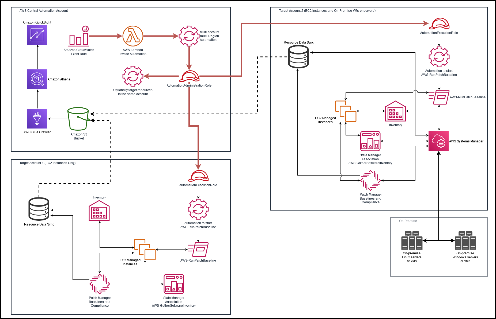
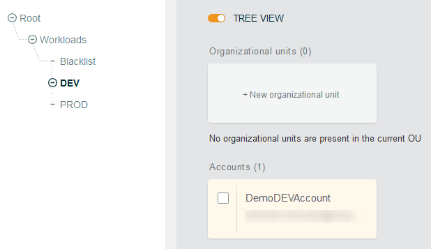
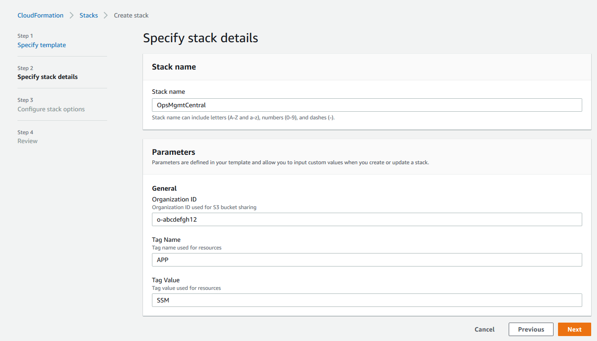
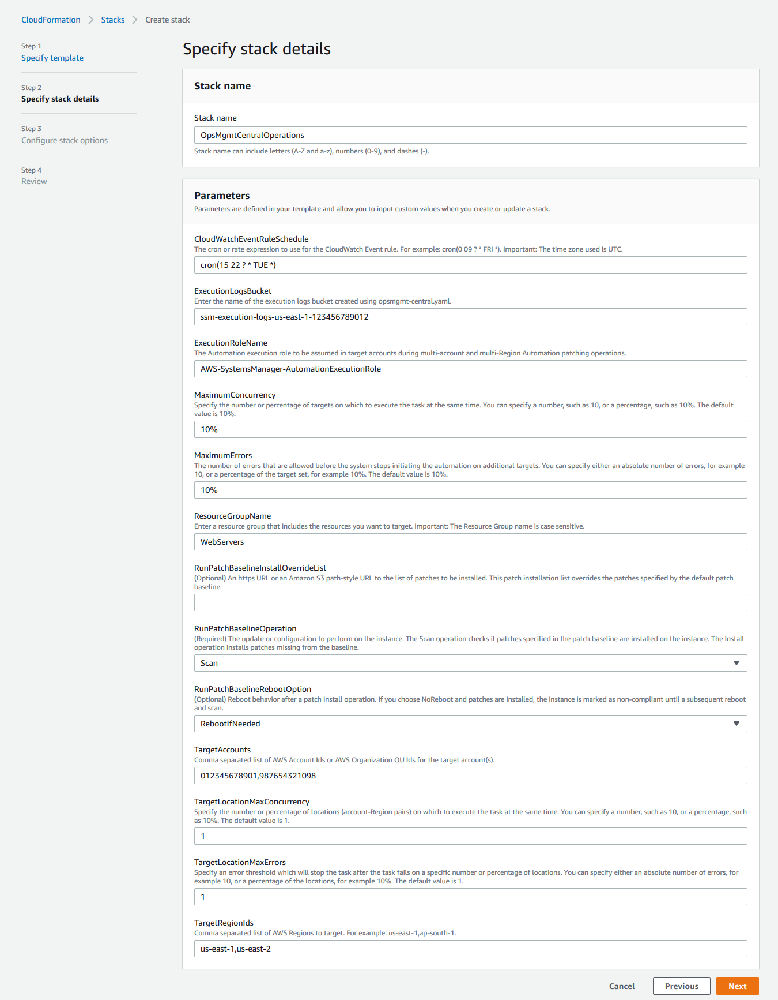
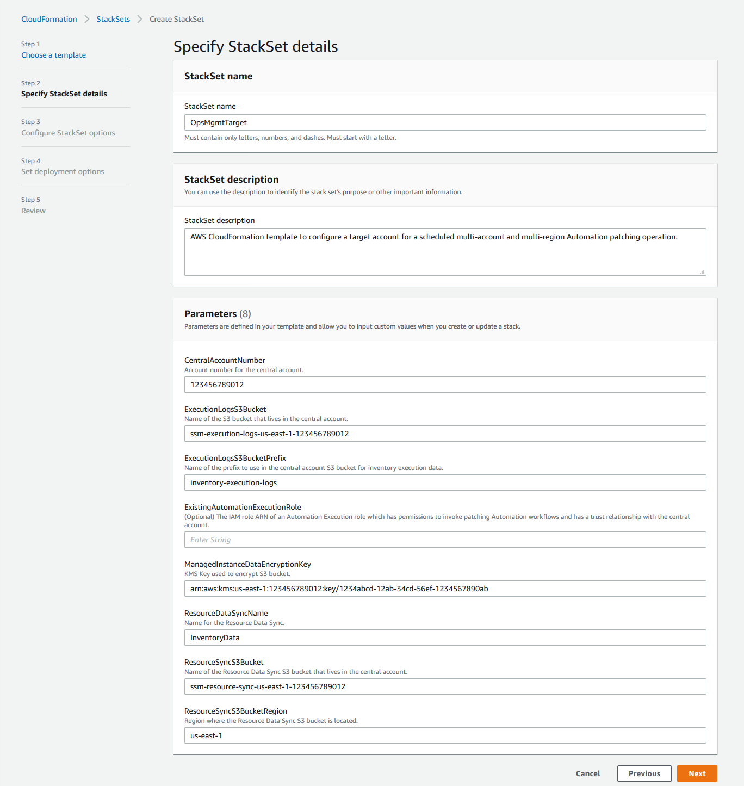
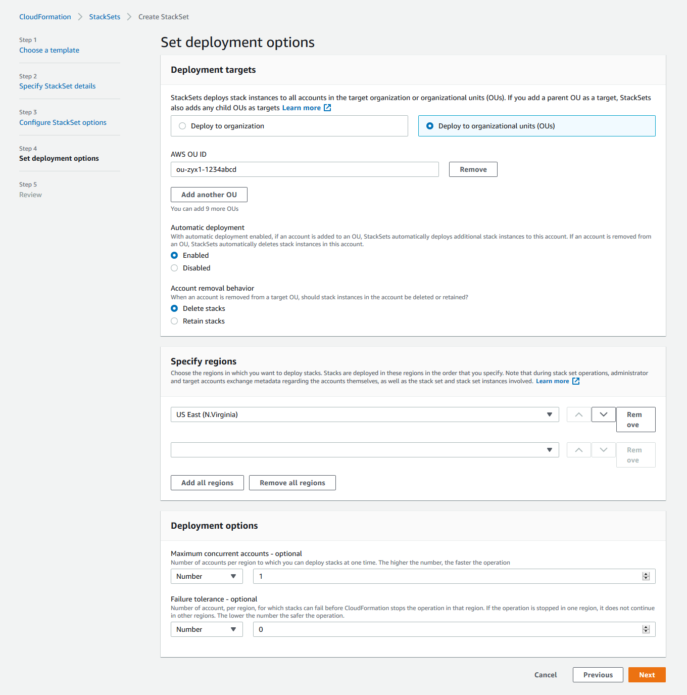

# Operational Management: Inventory, Patching, and Compliance

# Overview

The purpose of this series of CloudFormation templates is to setup a scheduled multi-account and multi-Region (MAMR) patching operation using CloudWatch Events, Lambda, and Systems Manager Automation. Additionally, Systems Manager Inventory is enabled using a State Manager association. The patching, inventory, and compliance data gathered can then be queried and reported on using Amazon Athena or Amazon QuickSight.

# Table of Contents

- [Service Concepts](#service-concepts)
- [Architecture Diagram](#architecture-diagram)
  - [Resulting Environment](#resulting-environment)
    - [(Optional) Patch Microsoft Applications](#optional-patch-microsoft-applications)
  - [Architecture Workflow](#architecture-workflow)
    - [Patching Process](#patching-process)
    - [Inventory Data Gathering Process](#inventory-data-gathering-process)
  - [Architecture Notes](#architecture-notes)
- [Pre-Requisites](#pre-requisites)
  - [Expectations](#expectations)
  - [Limitations](#limitations)
- [Resources Created - Central Account](#resources-created---central-account)
- [Resources Created - Target Account(s)](#resources-created---target-accounts)
- [Deployment Instructions](#deployment-instructions)
  - [Create the CloudFormation Stacks in the Central Account](#create-the-cloudformation-stack-in-the-central-account)
  - [Create the CloudFormation StackSet in the Central Account](#create-the-cloudFormation-stackset-in-the-central-account)
  - [(Optional) Deploy test instances](#optional-deploy-test-instances)
- [Post-Deployment Instructions](#post-deployment-instructions)
  - [Run the AWS Glue Crawler](#run-the-aws-glue-crawler)
    - [(Optional) Verify the Database and Tables within AWS Glue](#optional-verify-the-database-and-tables-within-aws-glue)
  - [Use AWS Athena to query Inventory, Patching, and Compliance data](#use-aws-athena-to-query-inventory-patching-and-compliance-data)
- [Tear-down Instructions](#tear-down-instructions)
  - [Remove resources from the Target Account(s)](#remove-resources-from-the-target-accounts)
  - [Remove resources from the Central Account](#remove-resources-from-the-central-account)
    - [Empty the S3 Bucket](#empty-the-s3-bucket)
    - [Delete the Database and Tables in AWS Glue](#delete-the-database-and-tables-in-aws-glue)
    - [Remove the CloudFormation stack in the Central Account](#remove-the-cloudFormation-stack-in-the-central-account)
- [Related References](#related-references)
- [Change Log](#change-log)
- [Roadmap Improvements](#roadmap-improvements)
- [FAQ](#faq)
- [Example IAM Policies and Trust Relationships](#example-iam-policies-and-trust-relationships)

# Service Concepts

In this section, we take a closer look at the following concepts of AWS Systems Manager and AWS Glue.

| Service | Term | Definition |
| --- | --- | --- |
| AWS Systems Manager | Automation Document | A Systems Manager **automation document**, or playbook, defines the Automation workflow (the actions that Systems Manager performs on your managed instances and AWS resources). Automation includes several pre-defined Automation documents that you can use to perform common tasks like restarting one or more Amazon EC2 instances or creating an Amazon Machine Image (AMI). You can create your own Automation documents as well. Documents use JavaScript Object Notation (JSON) or YAML, and they include steps and parameters that you specify. For more information, see [Working with Automation Documents (Playbooks)](https://docs.aws.amazon.com/systems-manager/latest/userguide/automation-documents.html). |
| AWS Systems Manager | Automation Administration Role | This role gives the user permission to run Automation workflows in multiple AWS accounts and OUs. You only need to create this role in the Automation management account. We **recommend** not changing the role name as specified in the template to something besides AWS-SystemsManager-AutomationAdministrationRole. Otherwise, your multi-Region and multi-Account Automation workflows might fail. For more information, see [Running Automation Workflows in Multiple AWS Regions and Accounts](https://docs.aws.amazon.com/systems-manager/latest/userguide/systems-manager-automation-multiple-accounts-and-regions.html). |
| AWS Systems Manager | Automation Execution Role | This role gives Systems Manager permission to perform actions on your behalf. You must create this role in every account that you want to target to run multi-Region and multi-account Automations. We **recommend** not changing the role name as specified in the template to something besides AWS-SystemsManager-AutomationExecutionRole. Otherwise, your multi-Region and multi-Account Automation workflows might fail. For more information, see [Running Automation Workflows in Multiple AWS Regions and Accounts](https://docs.aws.amazon.com/systems-manager/latest/userguide/systems-manager-automation-multiple-accounts-and-regions.html). |
| AWS Systems Manager | Resource Data Sync | You can use Systems Manager **resource data sync** to send inventory data collected from all of your managed instances to a single Amazon S3 bucket. Resource data sync then automatically updates the centralized data when new inventory data is collected. For more information, see [Configuring Resource Data Sync for Inventory](https://docs.aws.amazon.com/systems-manager/latest/userguide/sysman-inventory-datasync.html). |
| AWS Systems Manager | Patch Baseline | A **patch baseline** defines which patches are approved for installation on your instances. You can specify approved or rejected patches one by one. You can also create auto-approval rules to specify that certain types of updates (for example, critical updates) should be automatically approved. The rejected list overrides both the rules and the approve list. For more information, see [About Predefined and Custom Patch Baselines](https://docs.aws.amazon.com/systems-manager/latest/userguide/sysman-patch-baselines.html) |
| AWS Systems Manager | Patch Group | You can use a **patch group** to associate instances with a specific patch baseline. Patch groups help ensure that you are deploying the appropriate patches, based on the associated patch baseline rules, to the correct set of instances. Patch groups can also help you avoid deploying patches before they have been adequately tested. For example, you can create patch groups for different environments (such as Development, Test, and Production) and register each patch group to an appropriate patch baseline. **Note**: A managed instance can only be in one patch group. You create a patch group by using Amazon EC2 tags or Systems Manager resource tags. Unlike other tagging scenarios across Systems Manager, a patch group **must** be defined with the tag key: **Patch Group**. Note that the key is case-sensitive. You can specify any value, for example ```web servers``` but the key must be **Patch Group**.For more information, see [About Patch Groups](https://docs.aws.amazon.com/systems-manager/latest/userguide/sysman-patch-patchgroups.html). |
| AWS Systems Manager | Activation Code | To set up servers and virtual machines (VMs) in your hybrid environment as managed instances, you need to create a managed-instance **activation**. After you successfully complete the activation, you immediately receive an **Activation Code** and **Activation ID**. You specify this Code/ID combination when you install SSM Agent on servers and VMs in your hybrid environment. The Code/ID provides secure access to the Systems Manager service from your managed instances. For more information, see [Setting Up AWS Systems Manager for Hybrid Environments](https://docs.aws.amazon.com/systems-manager/latest/userguide/systems-manager-managedinstances.html). |
| AWS Glue | Crawler | A **crawler** accesses your data store, extracts metadata, and creates table definitions in the AWS Glue Data Catalog.For more information, see [Working with Crawlers on the AWS Glue Console](https://docs.aws.amazon.com/glue/latest/dg/console-crawlers.html). |

# Architecture Diagram



## Resulting Environment

After deploying the provided CloudFormation templates in the central account and target account(s), you will have a scheduled CloudWatch Event. The CloudWatch Event will then invoke a Lambda function to call a multi-account and multi-region Automation operation for patching managed instances using the Command document ```AWS-RunPatchBaseline```. After the first execution of the CloudWatch Event (based on the schedule provided), patching and the resulting patch compliance data will be available for your targeted managed instances.

The default option for the patching operation is to scan for missing updates. You can optionally choose the ```Install``` operation when deploying the CloudFormation template which will scan and install any missing updates on the target managed instances. During the patching operation, the managed instance will scan (or install) patches based on the patch baseline approval rules. For more information, see [About Predefined and Custom Patch Baselines](https://docs.aws.amazon.com/systems-manager/latest/userguide/sysman-patch-baselines.html) and [About Patch Groups](https://docs.aws.amazon.com/systems-manager/latest/userguide/sysman-patch-patchgroups.html). To create a custom patch baseline, see [Create a Custom Patch Baseline](https://docs.aws.amazon.com/systems-manager/latest/userguide/sysman-patch-baseline-console.html).

Additionally, a State Manager Association will be created to gather software inventory data (applications installed, AWS components, network configuration, etc.). Compliance data will be reported based on the success of gathering of inventory data (Compliant if the operation completed successfully or non-compliant if the resource did not gather inventory successfully).

The patching data, inventory data, and resulting compliance data will then be exported to the centralized S3 bucket via a Resource Data Sync created in each target account. You can then use AWS Glue, Amazon Athena, and Amazon QuickSight to report and visualize this data across your environment.

### (Optional) Patch Microsoft Applications

_Note: If you do not intend on patching Microsoft Applications (e.g. Microsoft Office, Microsoft Active Directory, or Microsoft SQL) then you can skip this section._

You can configure Patch Baselines to select and apply Microsoft application patches automatically across your Amazon EC2 or on-premises instances. All application patches available in the Microsoft update catalog are supported. For more information, see [About Patching Applications on Windows Server](https://docs.aws.amazon.com/systems-manager/latest/userguide/about-windows-app-patching.html).

**Important**: Microsoft application patching is available at no additional charge for EC2 instances and incurs a charge as part of the On-Premises Instance Management advanced tier when used on premises; see the [pricing page](https://aws.amazon.com/systems-manager/pricing/) for details.

## Architecture Workflow

### Patching Process

1. CloudWatch Event triggers based on schedule.
2. CloudWatch Event rule initiates the Lambda function to call the Automation API ```StartAutomationExecution``` against the targeted accounts and regions.
3. The Automation workflow is initiated in each target account and region.
4. The workflow initiates the Run Command document ```AWS-RunPatchBaseline``` with the operation specified.
5. Results from the Run Command task are outputted to the centralized S3 bucket.
6. Patch Compliance data is reported to Patch Manager.
7. The Resource Data Sync takes the Patch Compliance data and outputs to the centralized S3 bucket.

### Inventory Data Gathering Process

1. The State Manager Association triggers using the rate of 1 day to gather software inventory data.
2. The Inventory data is reported to Systems Manager.
3. The Resource Data Sync takes the Inventory data and outputs to the centralized S3 bucket.

## Architecture Notes

- The Inventory execution logs will be segmented by account ID and region. For example:

```ssm-execution-logs-us-east-1-123456789012/inventory-execution-logs/accountid=123456789012/region=us-east-1/i-1234567890EXAMPLE/.../stdout```

- The full output results of the ```AWS-RunPatchBaseline``` operation can be located in the central S3 bucket under the prefix patching. This is then segmented by account ID and region. For example:

```ssm-execution-logs-us-east-1-123456789012/patching/accountid=123456789012/region=us-east-1/executionid={{automation:EXECUTION_ID}}/<run-command-id>…/stdout```

- The State Manager Association for ```AWS-GatherSoftwareInventory``` is configured to run once a day and gathers the default Inventory parameters. For more information, see [Metadata Collected by Inventory](https://docs.aws.amazon.com/systems-manager/latest/userguide/sysman-inventory-schema.html).

- The Glue Crawler is configured to run once a day at 00:00 UTC.

# Pre-Requisites

Register your EC2 instance or on-premise hybrid instances. For more information, see [Setting Up AWS Systems Manager](https://docs.aws.amazon.com/systems-manager/latest/userguide/systems-manager-setting-up.html) and [Setting Up AWS Systems Manager for Hybrid Environments](https://docs.aws.amazon.com/systems-manager/latest/userguide/systems-manager-managedinstances.html).

## Expectations

1. If applicable, you have registered your on-premise VMs and servers to Systems Manager. For more information, see [Setting Up AWS Systems Manager for Hybrid Environments](https://docs.aws.amazon.com/systems-manager/latest/userguide/systems-manager-managedinstances.html).

1. For your EC2 instances or if you are using hybrid managed instances (```mi-*```), then you must grant S3 permissions to the central S3 bucket in order to export patching and Inventory execution logs. For more information, see [Step 2: Create an IAM Service Role for a Hybrid Environment](https://docs.aws.amazon.com/systems-manager/latest/userguide/sysman-service-role.html).

    An example IAM policy snippet is as follows (you must replace the S3 ARN with the ARN of the S3 bucket created by the Central account CFN template):

    ```json
    {
        "Effect": "Allow",
        "Action": [
            "s3:GetObject",
            "s3:PutObject",
            "s3:PutObjectAcl"
        ],
        "Resource": [
            "arn:aws:s3:::ssm-execution-logs-us-east-1-123456789012",
            "arn:aws:s3:::ssm-execution-logs-us-east-1-123456789012/*"
        ]
    }
    ```

1. You create patch baselines with the appropriate approval rules and exceptions. For more information, see [About Predefined and Custom Patch Baselines](https://docs.aws.amazon.com/systems-manager/latest/userguide/sysman-patch-baselines.html). To create a custom patch baseline, see [Create a Custom Patch Baseline](https://docs.aws.amazon.com/systems-manager/latest/userguide/sysman-patch-baseline-console.html).

1. The Automation runbook targets Systems Manager managed instances using Resource Groups. To scan for missing patches or install updates on your managed instances, the resources must be in the targeted Resource Group. For more information, see [Build a Query and Create a Group](https://docs.aws.amazon.com/ARG/latest/userguide/gettingstarted-query.html#gettingstarted-query-console) in the _AWS Resource Groups User Guide_. Please note, the Resource Group must have the exact same name in all target account(s).

## Limitations

### Targeting Limitations
- You can only target one Resource Group.
- Multi-account and multi-Region Automation can target AWS Account IDs or AWS Organization OU IDs. If you want to target Organization OU IDs, then the central account CloudFormation stack must be created within the master Organizations account.
   - When targeting using Organization OU IDs, you must target the OU which contains AWS accounts IDs directly. You cannot specify an OU which contains further nested OUs. For example, in the following screenshot you can see a simple Organization tree where the ```DEV``` OU contains a single account. When calling a multi-account/multi-Region Automation workflow, you must target the ```DEV``` OU and cannot target parent OUs, such as ```Workloads``` or ```Root```.
   
- To target resource tags instead of Resource Groups, you must modify the Automation document in the CloudFormation template, ```opsmgmt-operations-central-account.yaml```. An example modification is as follows:

```
  Targets:
  - Key: 'tag:Name'
    Values:
      - !Ref TagValue
```

# Resources Created - Central Account

### Resources created by opsmgmt-central-account.yaml

Amazon S3 Resources:

- ResouceSyncBucket: S3 Bucket for Resource Data Sync to gather Systems Manager Inventory, Patching, and Compliance data across accounts and regions. Example name: ```ssm-resource-sync-us-east-1-123456789012```
- ResouceSyncBucketPolicy: S3 Bucket Policy for Resource Data Sync bucket to permit Systems Manager access across organization
- ExecutionLogsBucket: S3 Bucket for execution logs to store execution logs generated by patching and inventory data gathering operations across accounts and regions. Example name: ```ssm-execution-logs-us-east-1-123456789012```
- ExecutionLogsBucketPolicy: S3 Bucket Policy to permit access across organization
- AthenaQueryResultsBucket: S3 Bucket to store Athena query details

AWS KMS Resources:

- ManagedInstanceDataEncryptionKey: KMS key used to encrypt instance data
- ManagedInstanceDataEncryptionKeyAlias: KMS key alias

AWS Lambda Resources:

- DeleteGlueTableColumnFunctionRole: IAM Service Role for Lambda to remediate Glue table
- DeleteGlueTableColumnFunction: Lambda Function to remediate Glue table

AWS Systems Manager Resources:

- AutomationAdministrationServiceRole: Automation Administration IAM Service Role

Amazon CloudWatch Resources:

- DeleteGlueTableColumnFunctionEventRule: CloudWatch Event Rule to invoke Lambda function following successful Glue Crawler execution
- DeleteGlueTableColumnFunctionCloudWatchPermission: Permissions for CloudWatch Event initiate the Lambda function

AWS Glue Resources:

- GlueDatabase: Glue Database for resource data sync data
- GlueCrawler: Crawler to tables within the database
- GlueCrawlerRole: IAM Service Role for AWS Glue

Amazon Athena Resources:

- Four example Athena named queries:
  - AthenaQueryNonCompliantPatch: List managed instances that are non-compliant for patching
  - AthenaQuerySSMAgent: List SSM Agent versions installed on managed instances
  - AthenaQueryInstanceList: List non-terminated instances
  - AthenaQueryInstanceApplications: List applications for non-terminated instances

### Resources created by opsmgmt-operations-central-account.yaml

Amazon CloudWatch Resources:

- CWScheduleEventCFN: CloudWatch Event Rule scheduled based on cron or rate expression
- PermissionForEventsToInvokeLambda: Permissions for CloudWatch Event initiate the Lambda function

AWS Lambda Resources:

- AWSLambdaSSMMultiAccountRole: IAM Service Role for Lambda
- MultiAccountPatchingLambdaFunction: Lambda Function to invoke MAMR Automation

AWS Systems Manager Resources:

- AutomationDocumentMamrRunPatchBaseline: Automation Document for executing the Command document ```AWS-RunPatchBaseline```

# Resources Created - Target Account(s)

### Resources created by opsmgmt-target-account.yaml

**Note**: You can optionally choose to provide an existing IAM role for the Automation Execution role. To confirm this role is configured appropriately, see [Example IAM Policies and Trust Relationships](#example-iam-policies-and-trust-relationships).

AWS Systems Manager Resources:

- AutomationExecutionServiceRole: Automation Execution IAM Service Role
- ResourceDataSync: Resource Data Sync
- InventoryAssociation: State Manager Association for ```AWS-GatherSoftwareInventory```

# Deployment Instructions

## Create the CloudFormation Stacks in the Central Account

### Deploy initial resources using opsmgmt-central-account.yaml

1. Open the [CloudFormation console](https://console.aws.amazon.com/cloudformation/)
1. Select **Create stack** and then **With new resources (standard)**.
1. Choose **Upload a template file** and select ```opsmgmt-central-account.yaml``` from your local machine.
1. Choose **Next**.
1. Enter a stack name.
1. For the **Parameters** section, enter the following information:
   1. For **Organization ID**, enter the Organization ID to be used for S3 bucket sharing.
   1. For **Tag Name**, enter the tag name used for resources.
   1. For **Tag Value**, enter the tag value used for resources.

1. Choose **Next**.
1. Choose **Next**.
1. Select **I acknowledge that AWS CloudFormation might create IAM resources with custom names**.
1. Choose **Create stack**.

### Deploy operations resources using opsmgmt-operations-central-account.yaml

1. Open the [CloudFormation console](https://console.aws.amazon.com/cloudformation/)
1. Select **Create stack** and then **With new resources (standard)**.
1. Choose **Upload a template file** and select ```opsmgmt-operations-central-account.yaml``` from your local machine.
1. Choose **Next**.
1. Enter a stack name.
1. For the **Parameters** section, enter the following information:
   1. For **CloudWatchEventRuleSchedule**, enter a cron or rate based expression for the schedule of the CloudWatch Event rule. For example, ```cron(15 22 ? * TUE *)``` will schedule the rule to initiate patching on Tuesdays at 22:15 UTC.
   1. For **ExecutionLogsBucket**, enter the name of the execution logs bucket created using ```opsmgmt-central-account.yaml```.
   1. For **ExecutionRoleName**, optionally modify the Automation execution role to be assumed in the target accounts. Note: The next section includes a CloudFormation template which creates the Automation Execution role with the name AWS-SystemsManager-AutomationExecutionRole.
   1. For **MaximumConcurrency**, specify the maximum number of targets allowed to run this task in parallel. You can specify a y, such as 10, or a percentage, such as 10%. The default value is 10%.
   1. For **MaximumErrors**, specify the maximum number of errors that are allowed before the system stops running the task on additional targets. You can specify a number, such as 10, or a percentage, such as 10%. The default value is 10%.
   1. For **ResourceGroupName**, specify the name of the Resource Group that includes the resources you want to target. Important: The Resource Group name is case sensitive.
   1. For **RunPatchBaselineInstallOverrideList**, optionally enter an https URL or an Amazon S3 path-style URL to the list of patches to be installed. This patch installation list overrides the patches specified by the default patch baseline.
   1. For **RunPatchBaselineOperation**, choose Scan to scan for missing updates only. Choose Install to scan and install missing updates based on the rules of the patch baseline.
   1. For **RunPatchBaselineRebootOption**, choose the reboot behavior for the patching operation. The default option, RebootIfNeeded, enforces a reboot if updates are installed. **Important**: Updates are not installed if the Scan operation is selected. Valid options are RebootIfNeeded and NoReboot. For more information, see [AWS-RunPatchBaseline Parameters](https://docs.aws.amazon.com/systems-manager/latest/userguide/patch-manager-about-aws-runpatchbaseline.html#patch-manager-about-aws-runpatchbaseline-parameters).
   1. For **TargetAccounts**, enter the list of target accounts as a comma-separated list. You can specify AWS Account IDs or AWS Organizations OU IDs. For example:
   ```012345678901,987654321098,ou-ab12-cdef3456```
   1. For **TargetLocationMaxConcurrency**, optionally modify the maximum number of AWS accounts and AWS regions allowed to run the Automation concurrently. The default value is 1.
   1. For **TargetLocationMaxErrors**, optionally modify the maximum number of errors allowed before the system stops queuing additional Automation executions at the account-region pair level. The default value is 1.
   1. For **TargetRegionIds**, enter the list of target regions as a comma-separated list. For example: ```us-east-1,us-east-2```.

1. Choose **Next**.
1. Choose **Next**.
1. Select **I acknowledge that AWS CloudFormation might create IAM resources with custom names**.
1. Choose **Create stack**.

The stack creation process for the central account will take approximately 5 minutes. Once the status of the stack changes to ```CREATE_COMPLETE```, proceed with the next section.

## Create the CloudFormation StackSet in the Central Account

1. Open the [CloudFormation console](https://console.aws.amazon.com/cloudformation/) in the central account.
1. From the left navigation pane, choose **StackSets**, and then choose **Create StackSet**.
1. Select **Create StackSet**.
1. Choose **Upload a template file** and select ```opsmgmt-target-account.yaml``` from your local machine.
1. Choose **Next**.
1. Enter a StackSet name.
1. For the **Parameters** section, enter the following information:
   1. For **CentralAccountNumber**, enter the account ID of the account where the central template is deployed.
   1. For **ExecutionLogsS3Bucket**, enter the name of the execution logs S3 bucket created in the central account. The S3 bucket name can be found in the Output tab of the CloudFormation stack in the central account created using the ```opsmgmt-central-account.yaml``` template. The S3 bucket name will follow the format of ssm-execution-logs-region-account-id. For example:
   ```ssm-execution-logs-us-east-1-123456789012```
   1. For **ExecutionLogsS3BucketPrefix**, optionally modify the S3 bucket prefix for the Inventory execution logs.
   1. For **ExistingAutomationExecutionRole**, optionally enter the ARN of the IAM role that is configured as an execution role for multi-account and multi-Region Automation workflows. **Important**: The name of the IAM role must match the ExecutionRoleName provided in the management account.
   1. For **ManagedInstanceDataEncryptionKey**, enter the ARN of the KMS key used to encrypt S3 bucket logs. The KMS key ARN can be found in the Output tab of the CloudFormation stack in the central account created using the ```opsmgmt-central-account.yaml``` template. An example KMS key ARN is as follows:
   ```arn:aws:kms:us-east-1:123456789012:key/1234abcd-12ab-34cd-56ef-1234567890ab```
   1. For **ResourceDataSyncName**, optionally modify the name used for the Resource Data Sync.
   1. For **ResourceSyncS3Bucket**, enter the name of the Resource Data Sync S3 bucket that lives in the central account. The S3 bucket name can be found in the Output tab of the CloudFormation stack in the central account created using the ```opsmgmt-central-account.yaml``` template. The S3 bucket name will follow the format of ssm-resource-sync-region-account-id. For example:
   ```ssm-resource-sync-us-east-1-123456789012```
   1. For **ResourceSyncS3BucketRegion**, enter the region where the central account S3 bucket is created.

1. Choose **Next**.
1. On the **Configure StackSet options** page, add any required tags. The content of the **Permissions** section varies, depending on whether you have AWS Organizations enabled: 
   1. If you do not have AWS Organizations enabled, choose **Self service permissions**, and then choose **Next**.
   1. If you have AWS Organizations enabled, you can choose **Service managed permissions** to apply the StackSets to an organization or OU. For demonstration purposes, this walkthrough will use the **Service managed permissions**, subsequent steps may differ if you choose **Self service permissions**. Choose **Next**.
1. In the **Set deployment options** page, choose **Deploy to organization units (OUs)** and enter the AWS OU ID where you want to deploy the stackSet.
1. Optionally modify the **Automatic deployment** and **Account removal behavior** options.
1. In the **Specify regions** section, choose the region in which you want to deploy stacks. **Important:** Only specify one region for the initial StackSet. If you want to deploy to multiple regions within the same account, then you must create a new StackSet and provide an IAM ARN value for **ExistingAutomationExecutionRole**.
1. In the **Deployment options** section, optionally modify the values for **Maximum concurrent accounts** and **Failure tolerance**.

1. Choose **Next**.
1. Select **I acknowledge that AWS CloudFormation might create IAM resources with custom names**.
1. Choose **Submit**.

The StackSet creation process for the target accounts will take some time. Once the status of the StackSet changes to ```ACTIVE``` and the status of each stack instances changes to ```CURRENT```, proceed with the next section.

## (Optional) Deploy test instances

Optionally, you can use the following instructions to deploy two test EC2 instances which have the tag key-value pair ```Patch:True``` and are joined to the Resource Group ```WebServers```. If you chose to target a different tag key-value pair, then you will need to modify the template below to use that tag. The template will launch one Amazon Linux instance and one Windows 2019 instance.

### Resources Created

- (Optionally) IAM Instance Profile role for Systems Manager
- VPC, subnet, route table, network ACL, security group, Internet Gateway
- Resource Group named ```WebServers```
- t2.small Amazon Linux instance
- t2.small Windows 2019 instance

### Instructions

1. Open the [CloudFormation console](https://console.aws.amazon.com/cloudformation/)
1. Select **Create stack** and then **With new resources (standard)**.
1. Choose **Upload a template file** and select ```opsmgmt-deploy-test-instances.yaml``` from your local machine.
1. Choose **Next**.
1. Enter a stack name.
1. For the **Parameters** section, enter the following information:
   1. For **ExecutionLogsS3Bucket**, enter the name of the execution logs S3 bucket created in the central account. The S3 bucket name can be found in the Resources tab of the CloudFormation stack in the central account. The S3 bucket name will follow the format of ```ssm-execution-logs-region-account-id```. For example: ```ssm-execution-logs-us-east-1-012345678901```
   1. For **ExistingManagedInstanceProfile**, enter the name of an existing IAM Instance Profile that is configured for Systems Manager. For example, ```ManagedInstanceProfile```.
1. Choose **Next.**
1. Choose **Next**.
1. Choose **Create stack**.

Repeat the above process to deploy instances to multiple accounts and Regions. **Important:** If you deploy to multiple regions within the same account, then you must provide IAM Instance Profile value for **ExistingManagedInstanceProfile**.

# Post-Deployment Instructions

## Run the AWS Glue Crawler

**Note**: Inventory data is gathered immediately for matching managed instances. Patch data (and the resulting compliance data specific to patching) will be gathered following the first invocation of the CloudWatch Event which is based on the schedule specified when creating the CloudFormation stack.

The AWS Glue Crawler is configured to run once a day. The first run will occur on the next occurence of 00:00 UTC following the creation of the CloudFormation stack. If you would like to review data within Athena prior to this time, you must manually run the Glue Crawler.

1. In the central account, open the [AWS Glue console](https://console.aws.amazon.com/glue/home).
1. Select **Crawlers** in the left-hand navigation pane.
1. Select the Glue Crawler created by the Central CloudFormation template. The name is ```SSM-GlueCrawler```
1. Select **Run crawler**.

The Crawler should run for approximately 2-4 minutes before stopping. Once the Crawler has returned to the ```Ready``` state, verify that tables were added to the resulting database. 

**Note**: 14 tables are added following successful patch scanning (or installing) process and Inventory data gathering process. If your CloudWatch Event rule has not executed yet, then you may have fewer tables added. Following a patching operation and the next execution of the Crawler, additional tables will be created automatically.

### (Optional) Verify the Database and Tables within AWS Glue

Following the successful run of the Crawler in the previous section, you can optionally choose to review the database and tables created.

1. In the central account, open the [AWS Glue console](https://console.aws.amazon.com/glue/home).
1. Select **Databases**, in the left-hand navigation pane.
1. Select the database created by the Crawler. The name should be similar to:
   
   ```ssm_global_resource_sync```
1. Select the option to review the tables for this specific database. The link is similar to the following:
   
   ```Tables in ssm_global_resource_sync```
1. Optionally, select a table to review additional details, such as the table properties, schema, and partitions.


## Use AWS Athena to query Inventory, Patching, and Compliance data

1. In the Central Account, open the [AWS Athena console](https://console.aws.amazon.com/athena/home).
1. Select **Saved Queries**.
1. Select the named query that you want to run.
   - **QueryNonCompliantPatch** - List managed instances that are non-compliant for patching.
   - **QuerySSMAgentVersion** - List SSM Agent versions installed on managed instances.
   - **QueryInstanceList** - List non-terminated instances.
   - **QueryInstanceApplications** - List applications for non-terminated instances.
1. After selecting a named query, ensure the ```ssm_global_resource_sync``` databse is selected.
1. Next, select **Run query** and view the results.
1. Optionally, select the **History** tab and select **Download results** to receive a CSV formatted output of the results.

# Tear-Down Instructions

## Remove resources from the Target Account(s)

1. In each Target account, open the [CloudFormation console](https://console.aws.amazon.com/cloudformation/).
1. If you followed the section [(Optional) Deploy test instances](#optional-deploy-test-instances), then first remove the CloudFormation stack(s) deployed.
1. Select **Delete**.
1. Select **Delete stack**.

## Remove resources from the Central Account

### Empty the S3 bucket

In order to remove the CloudFormation stack in the central account, you must first empty the S3 bucket created.

**Warning:** Following the below process will delete all inventory, patching, and compliance related data in the central S3 bucket.

1. In the Central account, open the [S3 console](https://s3.console.aws.amazon.com/s3/).
1. Open the bucket created in the section [Create the CloudFormation Stacks in the Central Account](#create-the-cloudformation-stack-in-the-central-account).
1. Select each prefix created (e.g. inventory-execution-logs, inventory, and patching).
1. Select **Actions** and then **Delete**.
1. Select **Delete**.

### Delete the Database and Tables in AWS Glue

1. In the central account, open the [AWS Glue console](https://console.aws.amazon.com/glue/home).
1. Select **Databases** in the left-hand navigation pane.
1. Select the database created by the Crawler. The name should be similar to:

   ```systems-manager-us-east-1-123456789012-database```
1. Choose **Action** and then **Delete database**.
1. Choose **Delete**.

### Remove the CloudFormation stack and StackSet in the Central account

1. In the Central account, open the [CloudFormation console](https://console.aws.amazon.com/cloudformation/).
1. Select the CloudFormation stack created in the section [Create the CloudFormation Stacks in the Central Account](#create-the-cloudformation-stack-in-the-central-account).
1. Select **Delete**.
1. Select **Delete stack**.

# Related References

### AWS Blogs:

[Centralized multi-account and multi-Region patching with AWS Systems Manager Automation](https://aws.amazon.com/blogs/mt/centralized-multi-account-and-multi-region-patching-with-aws-systems-manager-automation/)

[Understanding AWS Systems Manager Inventory Metadata](https://aws.amazon.com/blogs/mt/understanding-aws-systems-manager-inventory-metadata/)

### User Guide Documentation:

[About the SSM Document AWS-RunPatchBaseline](https://docs.aws.amazon.com/systems-manager/latest/userguide/patch-manager-about-aws-runpatchbaseline.html)

[Recording Software Configuration for Managed Instances](https://docs.aws.amazon.com/config/latest/developerguide/recording-managed-instance-inventory.html)

### Pricing:

[AWS Systems Manager Pricing](https://aws.amazon.com/systems-manager/pricing/)

[AWS Glue Pricing](https://aws.amazon.com/glue/pricing/)

[Amazon Athena Pricing](https://aws.amazon.com/athena/pricing/)

[Amazon S3 Pricing](https://aws.amazon.com/s3/pricing/)

[Amazon CloudWatch Pricing](https://aws.amazon.com/cloudwatch/pricing/)

# Example IAM Policies and Trust Relationships

The following section provides example IAM policies that you can attach to IAM roles and their associated Trust Relationships if you have elected to leverage existing IAM roles for the Automation Administration role, Automation Execution role, Lambda function role, Glue Crawler role, or the EC2 Instance IAM profile role.

#### Automation Administration role
<details>
<summary>IAM Permissions policy: AssumeRole-AWSSystemsManagerAutomationExecutionRole</summary><p>

```
{
    "Version": "2012-10-17",
    "Statement": [
        {
            "Action": [
                "sts:AssumeRole"
            ],
            "Resource": "arn:aws:iam::*:role/AWS-SystemsManager-AutomationExecutionRole",
            "Effect": "Allow"
        },
        {
            "Action": [
                "organizations:ListAccountsForParent"
            ],
            "Resource": [
                "*"
            ],
            "Effect": "Allow"
        }
    ]
}
```

</p></details>

<details>
<summary>Trust Relationship</summary><p>

```
{
  "Version": "2012-10-17",
  "Statement": [
    {
      "Effect": "Allow",
      "Principal": {
        "Service": "ssm.amazonaws.com"
      },
      "Action": "sts:AssumeRole"
    }
  ]
}
```

</p></details>

#### Automation Execution role
The Automation Execution role created in each target account has the AWS managed policy ```AmazonSSMAutomationRole``` attached in addition to three inline policies. The permissions granted within the inline policies can be viewed below.

<details>
<summary>IAM Permissions policy: getTagPermissions</summary><p>

```
{
    "Version": "2012-10-17",
    "Statement": [
        {
            "Action": [
                "tag:GetResources"
            ],
            "Resource": "*",
            "Effect": "Allow"
        }
    ]
}
```

</p></details>

<details>
<summary>IAM Permissions policy: listResourceGroupResourcesPermissions</summary><p>

```
{
    "Version": "2012-10-17",
    "Statement": [
        {
            "Action": [
                "resource-groups:listGroupResources"
            ],
            "Resource": "*",
            "Effect": "Allow"
        }
    ]
}
```

</p></details>

<details>
<summary>IAM Permissions policy: passRole</summary><p>

```
{
    "Version": "2012-10-17",
    "Statement": [
        {
            "Action": [
                "iam:PassRole"
            ],
            "Resource": [
                "arn:aws:iam::123456789012:role/AWS-SystemsManager-AutomationExecutionRole"
            ],
            "Effect": "Allow"
        }
    ]
}
```

</p></details>

<details>
<summary>Trust Relationship</summary><p>

```
{
  "Version": "2012-10-17",
  "Statement": [
    {
      "Effect": "Allow",
      "Principal": {
        "Service": "ssm.amazonaws.com",
        "AWS": "arn:aws:iam::123456789012:root"
      },
      "Action": "sts:AssumeRole"
    }
  ]
}
```

</p></details>

#### Glue Crawler role
The Glue Crawler role has the AWS managed policy ```AWSGlueServiceRole``` attached in addition to one inline policy. The permissions granted within the inline policy can be viewed below.

<details>
<summary>IAM Permissions policy: AWSLambdaSSMMultiAccountPolicy</summary><p>

```
{
    "Version": "2012-10-17",
    "Statement": [
        {
            "Action": [
                "s3:GetObject",
                "s3:PutObject"
            ],
            "Resource": [
                "arn:aws:s3:::systems-manager-us-east-1-123456789012/*"
            ],
            "Effect": "Allow"
        },
        {
            "Action": [
                "logs:CreateLogGroup",
                "logs:CreateLogStream",
                "logs:PutLogEvents"
            ],
            "Resource": [
                "*"
            ],
            "Effect": "Allow"
        }
    ]
}
```

</p></details>

<details>
<summary>Trust Relationship</summary><p>

```
{
  "Version": "2012-10-17",
  "Statement": [
    {
      "Effect": "Allow",
      "Principal": {
        "Service": "glue.amazonaws.com"
      },
      "Action": "sts:AssumeRole"
    }
  ]
}
```

</p></details>

#### EC2 Instance IAM profile role
The EC2 Instance IAM profile role has the AWS managed policy ```AmazonSSMManagedInstanceCore``` attached in addition to one inline policy. The permissions granted within the inline policy can be viewed below.

<details>
<summary>IAM Permissions policy: CentralAccountS3Permissions</summary><p>

```
{
    "Version": "2012-10-17",
    "Statement": [
        {
            "Action": [
                "s3:GetObject",
                "s3:PutObject",
                "s3:PutObjectAcl"
            ],
            "Resource": [
                "arn:aws:s3:::systems-manager-us-east-1-123456789012",
                "arn:aws:s3:::systems-manager-us-east-1-123456789012/*"
            ],
            "Effect": "Allow"
        }
    ]
}
```

</p></details>

<details>
<summary>Trust Relationship</summary><p>

```
{
  "Version": "2012-10-17",
  "Statement": [
    {
      "Effect": "Allow",
      "Principal": {
        "Service": "ec2.amazonaws.com"
      },
      "Action": "sts:AssumeRole"
    }
  ]
}
```

</p></details>